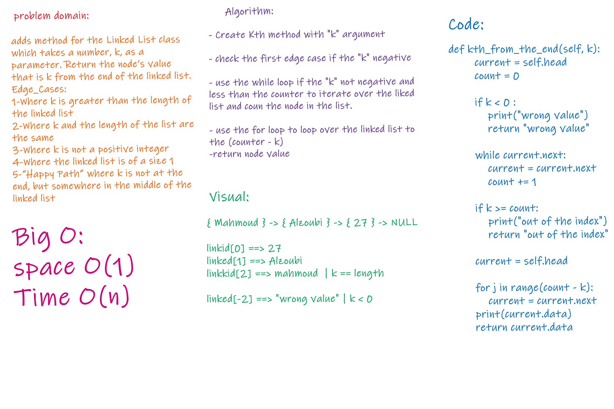

# summary
Using linked list with a method to find an element starting from the tail(reversly)

## Challenge
pass an index k - wich indicate starting from the end of the linked list- to a method in the linked list and return the element'data id exist

## Approach & Efficiency
insert at biggning O(1)/
insert at the end O(n)/
search for the element O(index(element))/
search for element that does not exist - Worst case- o(n)/
insertBefore O(n)/
insertafter O(n)/
k_method o(n)/

## API
append: add new data to the end of the linked list pre_add: add new data to the biggning of the linked list search: similar to include method insertBefore : add new data before an element in the linked-list insertafter: add new data after an element in the linked-list getitem: return element of index self.count-1-k

